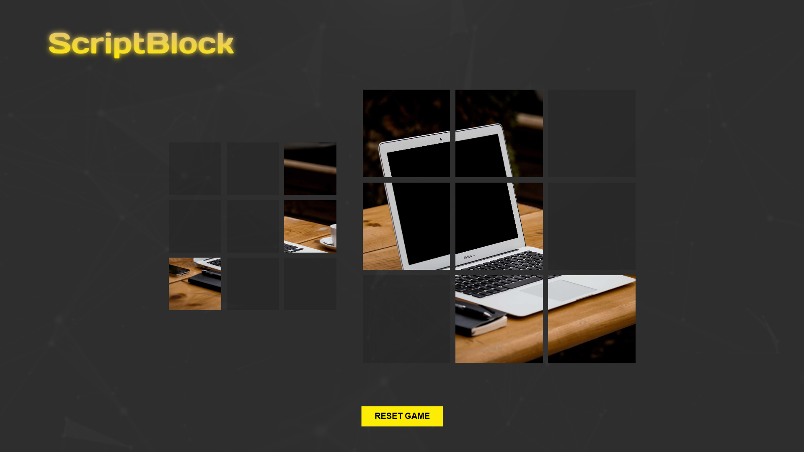
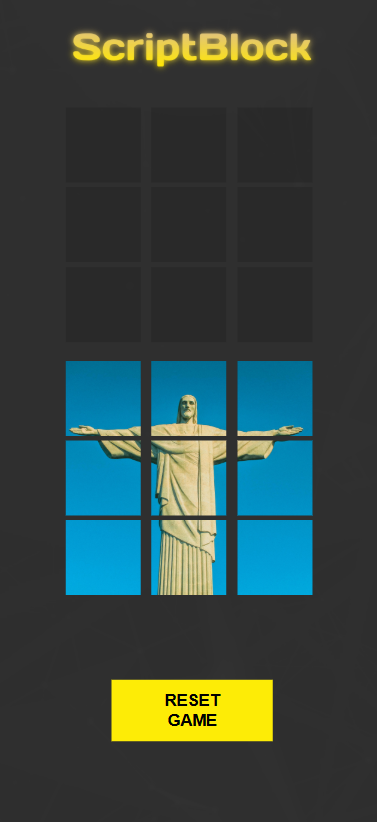
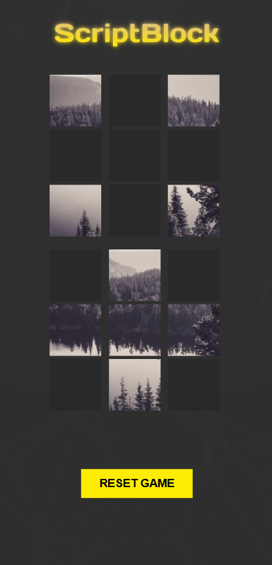
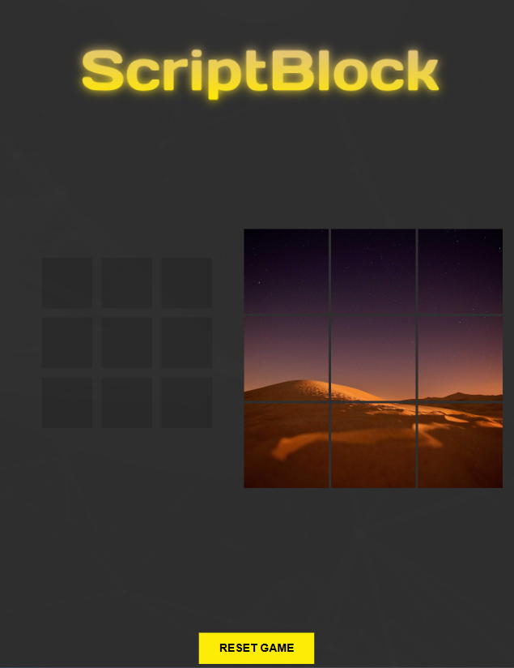
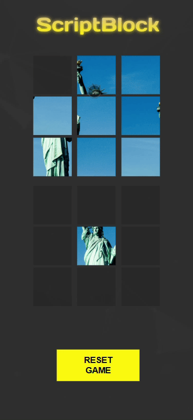

# Monte blocos o quanto quiser!

A regra é simples: ao se deparar com 9 blocos embaralhados de uma imagem aleatória, é preciso reconstruí-la e, ao mesmo tempo, testar suas habilidades de montagem.

Por meio de um arquivo .js, o programa busca uma imagem aleatória de uma URL e a recorta proporcionalmente ao tamanho estabelecido, permitindo gerar imagens praticamente "infinitas" para testar essa funcionalidade.

# Build as many blocks as you like!

The rule is simple: when faced with 9 shuffled blocks of a random image, your goal is to reconstruct it while testing your assembly skills.

Using a .js file, the program fetches a random image from a URL and slices it proportionally based on the defined size, effectively generating virtually "infinite" images to test this feature.

# Previews

| 
Desktop
 |
|:--:|
|  |

| 
Samsung Galaxy S20 Ultra
 |
|:--:|
|  |

| 
Iphone 14 Pro Max
 |
|:--:|
|  |

| 
Ipad Pro
 |
|:--:|
|  |

# Interface

# Gameplay Video Download Link
[github.com/Luiz-Display/ScriptBlock/blob/main/preview/scriptblock-desktop-gameplay.mp4](./preview/scriptblock-desktop-gameplay.mp4)
